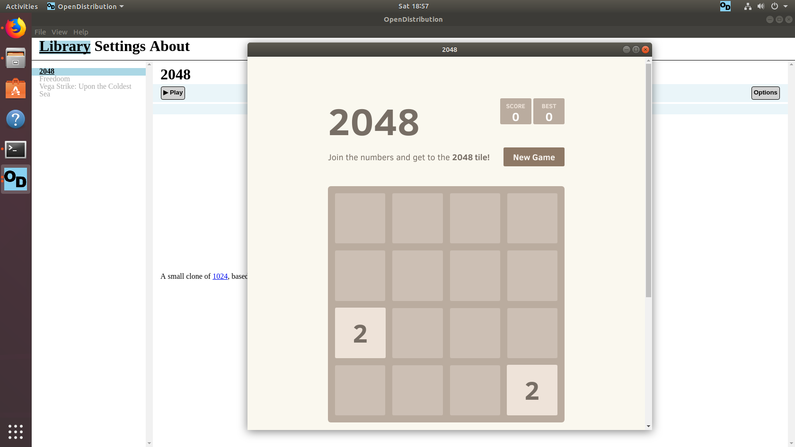

OpenDistribution
==============

Capstone Project for Group 1

Running
-------

### Windows

1. Install [node.js](https://nodejs.org/en/).
2. Run `RetreiveDependencies.bat`.
3. Run `Run.bat`.

### Ubuntu

1. Install [node.js](https://nodejs.org/en/).
2. Run `RetreiveDependencies.sh`.
3. Run `Run.sh`.

Developers
----------

* Walter Barrett
* Daniel Holton
* Patrick Raley
* James Thomas
* Kent White
